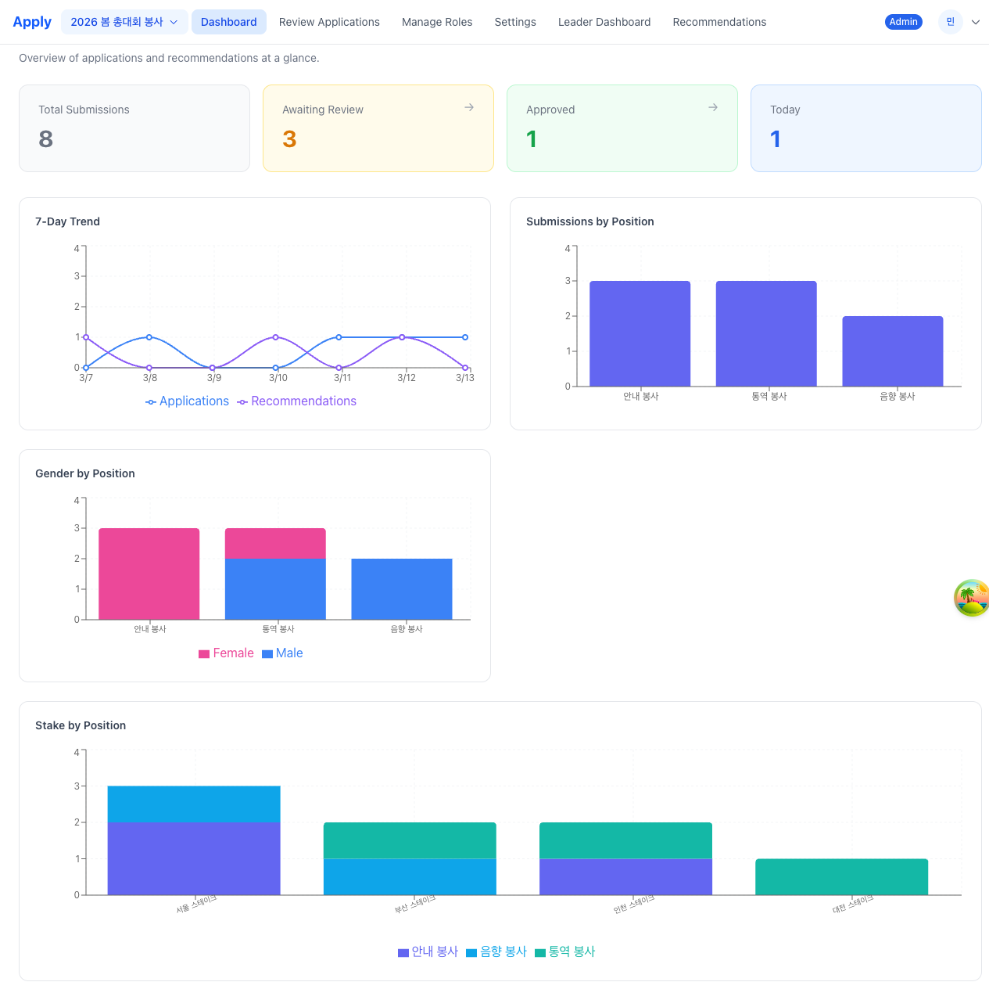
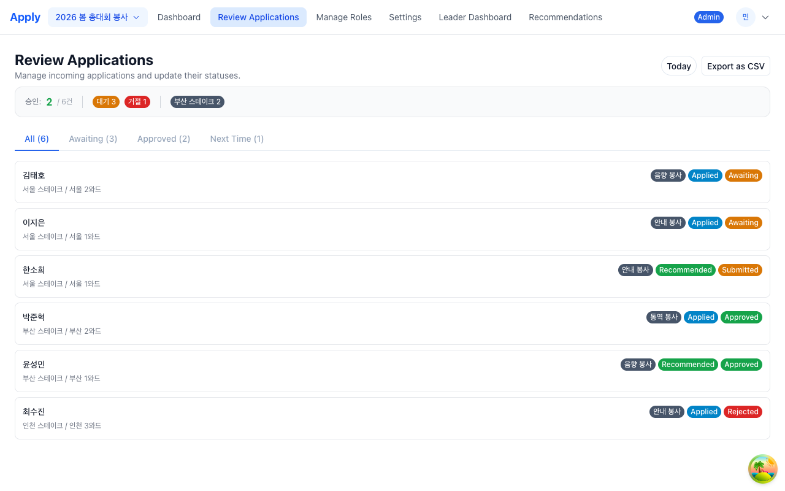

# Apply - 대회 신청 관리 시스템

대회 참가 신청서와 지도자 추천서를 통합 관리하는 웹 애플리케이션입니다. 신청자(Applicant), 지도자(Leader), 관리자(Admin) 역할에 따라 맞춤형 화면과 기능을 제공합니다.

## 주요 화면

### 관리자 대시보드

전체 신청서 및 추천서 현황을 한눈에 파악할 수 있는 대시보드입니다. 요약 카드(전체 제출, 검토 대기, 승인, 오늘 접수)와 함께 7일 추세 라인 차트, 포지션별 신청 현황, 포지션별 성별 분포, 스테이크별 포지션 분포 등 다양한 시각화 차트를 제공합니다.



### 신청서 검토

신청서와 추천서를 탭별(전체, 대기 중, 승인됨, 다음 기회에)로 필터링하여 검토할 수 있는 화면입니다. 목록에서 항목을 선택하면 Drawer로 상세 정보를 확인하고, 승인/거절 상태를 변경할 수 있습니다. 오늘 접수 필터와 승인 목록 CSV 내보내기 기능도 지원합니다.



## 기능 개요

- 역할 기반 접근 제어 (Applicant, Bishop, Stake President, Session Leader, Admin)
- 대회(Conference)별 신청서 및 추천서 관리
- 포지션 선택 및 자격 요건 안내
- 신청서/추천서 상태 워크플로우 (초안 → 제출 → 승인/거절)
- 대시보드 차트를 통한 통계 시각화 (Recharts)
- CSV 내보내기
- 다국어 지원 (i18n)
- 개인정보 동의(Consent) 관리
- 스테이크/와드 변경 승인 프로세스

## 신청자(Applicant) 기능

- **신청서 작성**: 대회를 선택한 후 이름, 나이, 성별, 이메일, 전화번호, 포지션, 선교 경험, 추가 정보를 입력하여 신청서를 작성합니다.
- **초안 저장**: 작성 중인 신청서를 초안으로 저장하고 나중에 이어서 작성할 수 있습니다.
- **미리보기**: 제출 전 신청서 내용을 Drawer에서 미리 확인합니다.
- **제출 및 수정**: 신청서를 제출한 후에도 승인/거절 전까지는 수정이 가능합니다.
- **상태 확인**: 현재 신청서의 상태(초안, 대기 중, 승인됨, 거절됨)를 확인합니다.
- **계정 설정**: 개인 정보 및 스테이크/와드 정보를 관리합니다.

## 지도자(Leader) 기능

- **추천서 작성**: 지원자 정보를 입력하여 추천서를 작성하고 제출합니다.
- **추천서 관리**: 탭별 필터링(전체, 초안, 검토 대기 중, 승인됨, 다음 기회에)으로 추천서를 관리합니다.
- **코멘트**: 추천서에 지도자 코멘트를 추가하고 관리합니다.
- **제출 취소**: 제출된 추천서를 다시 초안 상태로 되돌릴 수 있습니다.
- **리더 대시보드**: 추천서 상태 요약, 스테이크 내 신청서 현황, 포지션별/성별/와드별 분포 차트를 확인합니다.
- **승인 대기**: 지도자 계정 최초 등록 시 관리자 승인을 기다리는 대기 화면이 표시됩니다.

## 관리자(Admin) 기능

- **대시보드**: 전체 신청서/추천서 통계 및 추세 차트를 확인합니다.
- **신청서 검토**: 모든 신청서와 추천서를 검토하고 승인/거절합니다. Drawer 내에서 이전/다음 탐색과 자동 다음 항목 이동을 지원합니다.
- **역할 관리**: 사용자 목록을 조회하고 역할(applicant, bishop, stake_president, session_leader, admin)을 변경합니다. 지도자 승인/거절도 이 화면에서 처리합니다.
- **설정**: 대회 정보(이름, 설명, 마감일) 수정, 대회 비활성화/복원/영구 삭제, 포지션 생성/수정/삭제를 관리합니다.
- **CSV 내보내기**: 승인된 항목을 CSV 파일로 내보냅니다.

## 워크플로우

```
[신청자]                    [지도자]                    [관리자]
   |                          |                          |
   |-- 신청서 작성 ---------->|                          |
   |   (draft)                |                          |
   |                          |-- 추천서 작성 ---------->|
   |                          |   (draft)                |
   |                          |                          |
   |-- 신청서 제출 ---------> |                          |
   |   (awaiting)             |-- 추천서 제출 ---------> |
   |                          |   (submitted)            |
   |                          |                          |-- 검토
   |                          |                          |
   |<---- 승인 (approved) ----|--------------------------|
   |<---- 거절 (rejected) ----|--------------------------|
   |                          |                          |
   |                          |<-- 승인/거절 ------------|
```

## 라우트 테이블

| 경로 | 컴포넌트 | 접근 권한 | 설명 |
|------|----------|-----------|------|
| `/login` | LoginPage | 비로그인 사용자만 | 로그인 페면 |
| `/complete-profile` | CompleteProfilePage | 프로필 미완성 사용자 | 프로필 완성 페이지 |
| `/admin/dashboard` | AdminDashboard | Admin | 관리자 대시보드 |
| `/admin/review` | AdminReview | Admin | 신청서/추천서 검토 |
| `/admin/roles` | AdminRoles | Admin | 사용자 역할 관리 |
| `/admin/settings` | AdminSettings | Admin | 대회 및 포지션 설정 |
| `/leader/dashboard` | LeaderDashboard | Stake Leader | 지도자 대시보드 |
| `/leader/recommendations` | LeaderRecommendations | Leader | 추천서 관리 |
| `/leader/pending` | LeaderPending | Leader | 승인 대기 안내 |
| `/application` | UserApplication | Applicant | 신청서 작성/조회 |
| `/settings` | AccountSettings | 인증된 사용자 | 계정 설정 |

## 역할 테이블

| 역할 | 코드 | 설명 | 주요 권한 |
|------|------|------|-----------|
| 관리자 | `admin` | 시스템 전체 관리자 | 모든 신청서/추천서 조회, 상태 변경, 역할 관리, 대회 설정, 사용자 삭제 |
| 세션 리더 | `session_leader` | 세션 운영 관리자 | 모든 신청서/추천서 조회, 상태 변경 |
| 스테이크 회장 | `stake_president` | 스테이크 단위 지도자 | 스테이크 내 신청서 조회, 추천서 작성, 스테이크/와드 변경 승인 |
| 비숍 | `bishop` | 와드 단위 지도자 | 와드 내 신청서 조회, 추천서 작성, 와드 변경 승인 |
| 신청자 | `applicant` | 일반 사용자 | 신청서 작성 및 조회 |
