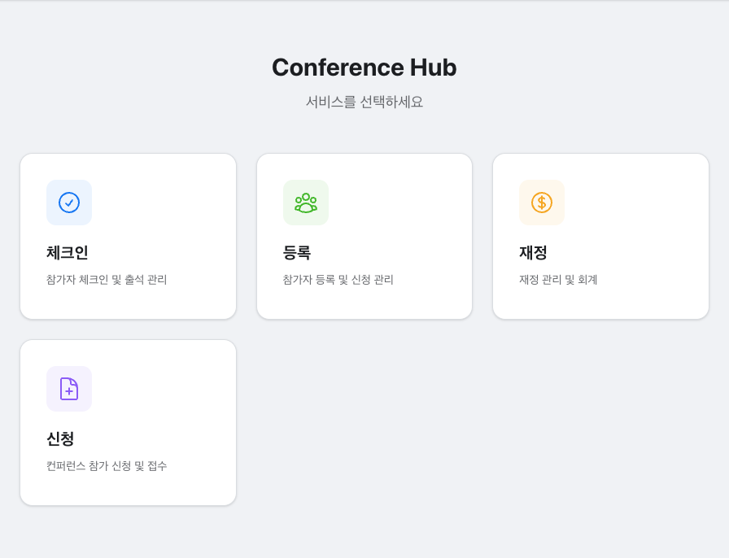

# @conference/hub

Conference 플랫폼의 서비스 허브 앱입니다. 각 서비스(체크인, 등록, 재정, 신청)로의 진입점 역할을 하며, 카드 형태의 대시보드 UI를 제공합니다.

## 주요 화면

## 주요 기능

- **서비스 대시보드** - 체크인, 등록, 재정, 신청 등 하위 서비스를 카드 UI로 탐색
- **다국어 지원** - 한국어/영어 전환 (i18next)
- **반응형 레이아웃** - 모바일/데스크톱 대응 그리드 구성

## 기술 스택

- React 19, TypeScript
- Vite
- Tailwind CSS
- i18next / react-i18next
- trust-ui-react
