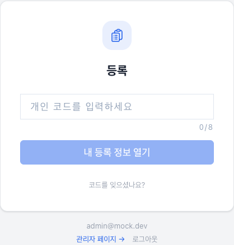
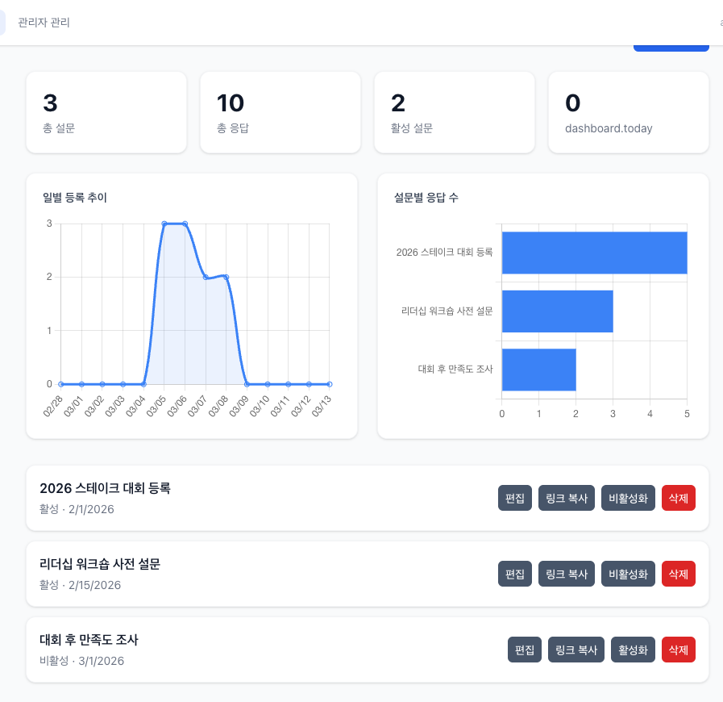

# Registration

대회 참가 등록 웹앱입니다. 관리자가 설문(등록 폼)을 생성하고, 참가자가 개인 코드를 입력하여 해당 설문에 접근 및 등록합니다.

## 주요 화면

### 코드 입력 (홈)

참가자가 개인 코드를 입력하여 등록 설문에 진입하는 화면입니다. 코드를 분실한 경우 이메일로 코드를 찾을 수 있으며, 관리자 로그인 링크도 제공됩니다.

### 관리자 설문 관리

설문 목록, 대시보드 통계, 설문 생성/삭제/활성화 관리 화면입니다. 각 설문의 응답 현황을 한눈에 확인하고, 등록 링크를 복사하여 참가자에게 공유할 수 있습니다.

## 주요 기능

### 코드 기반 등록

- 참가자는 개인 코드를 입력하여 설문에 접근
- 코드 입력 시 해당 설문으로 자동 이동
- 이메일을 통한 코드 찾기 지원
- 공유 토큰(shareToken)을 이용한 설문 접근 제어
- 개인정보 수집 동의 절차 포함

### 동적 설문 빌더

관리자가 다양한 필드 타입으로 설문을 자유롭게 구성할 수 있습니다.

- **short_text** / **long_text**: 단답형 및 장문형 텍스트
- **radio** / **checkbox** / **dropdown**: 선택형 질문
- **linear_scale**: 선형 배율 (최솟값/최댓값, 라벨 설정)
- **grid**: 행/열 그리드 (단일 선택 또는 다중 선택)
- **date** / **time**: 날짜 및 시간 입력
- **section**: 섹션 구분
- **church_info**: 교회 정보 입력 (스테이크/와드)
- 필드별 필수 여부, 너비(full/half), 그룹(같은 행 배치), 유효성 검사, 조건부 표시(dependsOn) 설정 가능
- 테마 편집 기능으로 설문 디자인 커스터마이징
- 저장 전 미리보기 지원

### 관리자 대시보드

- 전체 설문 목록 및 대시보드 통계 개요
- 설문별 상세 페이지에서 통계 및 응답 테이블 조회
- 설문 활성화/비활성화 토글
- 설문 삭제 (확인 다이얼로그)
- 등록 링크 복사 공유

### 관리자 관리

- 이메일 기반 관리자 추가/삭제
- Google 로그인 인증
- AdminAuthGuard를 통한 관리자 전용 페이지 보호

## 사용자 흐름

1. 참가자가 홈 화면(`/`)에서 개인 코드를 입력
2. 코드가 유효하면 해당 설문 등록 페이지(`/register/:surveyId`)로 이동
3. 개인정보 수집 동의 후 설문을 작성하여 제출
4. 등록 완료 페이지(`/register/:surveyId/success`)에서 개인 코드 확인
5. 이후 같은 코드로 재접속하면 기존 응답을 수정 가능

## 관리자 흐름

1. 홈 화면 하단의 관리자 로그인 링크를 클릭하여 Google 로그인
2. 설문 목록 페이지(`/admin`)에서 대시보드 통계를 확인하고 새 설문을 생성
3. 설문 편집 페이지(`/admin/survey/:surveyId/edit`)에서 질문 탭과 테마 탭으로 설문 구성
4. 미리보기(`/admin/survey/:surveyId/preview`)로 설문을 확인한 후 저장
5. 설문을 활성화하고 등록 링크를 참가자에게 공유
6. 설문 상세 페이지(`/admin/survey/:surveyId`)에서 응답 통계 및 개별 응답 조회
7. 관리자 관리 페이지(`/admin/admins`)에서 다른 관리자를 추가하거나 삭제

## 라우트

| 경로                              | 설명                                  |
| --------------------------------- | ------------------------------------- |
| `/`                               | 코드 입력 홈 화면                     |
| `/register/:surveyId`             | 참가 등록 폼                          |
| `/register/:surveyId/success`     | 등록 완료 페이지                      |
| `/admin`                          | 설문 목록 및 대시보드 (관리자)        |
| `/admin/admins`                   | 관리자 관리 (관리자)                  |
| `/admin/survey/:surveyId`         | 설문 상세 / 통계 / 응답 조회 (관리자) |
| `/admin/survey/:surveyId/edit`    | 설문 편집 (관리자)                    |
| `/admin/survey/:surveyId/preview` | 설문 미리보기 (관리자)                |

## 기술 스택

- React 19 + Vite 7 + TypeScript
- Tailwind CSS 4
- Jotai (상태 관리)
- react-i18next (다국어 지원)
- trust-ui-react (UI 컴포넌트 라이브러리)
- Firebase Authentication + Firestore
- Firebase Hosting
- React Router (SPA 라우팅)
- React.lazy + Suspense (관리자 페이지 코드 스플리팅)

## 배포

`main` 브랜치에 push하면 모노레포 루트의 GitHub Actions가 자동 배포합니다.

- 워크플로우: [`/.github/workflows/deploy.yml`](../../.github/workflows/deploy.yml)
- 시크릿 설정: [`/SETUP.md`](../../SETUP.md)
